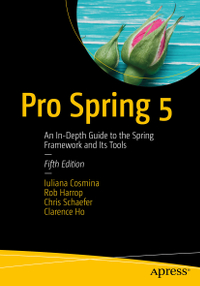

== Apress Source Code with my refactoring to gradle@7

This repository accompanies [*Pro Spring 5th Edition*](http://www.apress.com/9781484228074) by Iuliana Cosmina, Rob Harrop, Chris Schaefer, Clarence Ho (Apress, 2017).
This repository only work for gradle@4 so i refactoring build gralde to build with gradle@7

Download the files as a zip using the green button, or clone the repository to your machine using Git.

== Requirements
To be able to execute 'gradle clean build -x test' successfully you need at least *Java 8* installed.

The AspectJ plugin in module 'chapter05:aspectj-aspects' requires *Gradle 4.0*.

== Releases
Release v1.0 corresponds to the code in the published book, without corrections or updates.

== Corrections
For corrections to the content in the published book, see the file errata.md.

== Contributions
See the file Contributing.adoc for more information on how you can contribute to this repository.

== Building and Deploying
This is a Gradle multi-module project. Currently it can be compiled with Gradle 5.x and JDK 8. Build it from scratch using:
----
gradle clean build
----

Build it without tests using:
----
gradle build -x test 
----

Build it and copy dependencies into build/libs using:
----
gradle clean build copyDependencies
----

Using gradle wrappers
---
gradle wrapper
./gradlew wrapper --gradle-version=4.0.1 --distribution-type=all
gradle wrapper --gradle-version 4.0.1 --distribution-type all jar
gradle wrapper --gradle-version=4.4 --distribution-type=all  -Dorg.gradle.java.home=/Library/Java/JavaVirtualMachines/jdk1.8.0_231.jdk/Contents/Home clean build jar
java -jar -Xmx512m chapter02/hello-world/build/libs/hello-world-5.0-SNAPSHOT.jar
---

Run Class by gradle
---
gradle wrapper --gradle-version=4.4 --distribution-type=all  -Dorg.gradle.java.home=/Library/Java/JavaVirtualMachines/jdk1.8.0_231.jdk/Contents/Home run
gradle -Dorg.gradle.java.home=/Library/Java/JavaVirtualMachines/jdk1.8.0_231.jdk/Contents/Home -PmainClass=com.apress.prospring5.ch2.HelloWorldSpringDI wrapper --gradle-version=4.4 --distribution-type=all chapter02:hello-world:execute
---